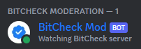

# BitCheck mod Discord bot

BitCheck mod is a bot that's used in the BitCheck Discord server to moderate the server.
You can easily manage tickets, ask help to fellow moderators, moderate channels and sanction users.
It also cointains a FAQ command to rapidly answer common questions with complex answers. This improves efficiency.



**The bot exclusively uses slash commands and context menu's.** 

You can find screenshots [here](https://github.com/BitCheckMe/discord-mod-bot/tree/master/image/readme "Command screenshots").

## Setup

#### **To setup the bot, simply edit the following values in the [config file](config.json):**

`token`: The bot token of your bot.

`log_channel`: The channel id of your log channel.

`moderation_channel`: The channel id of your moderation channel. 

`faq_file`: The path of the FAQ json file.

## Startup

First of all, make sure discord.py is installed. If this is not the case, use the following command:

```bash
pip install discord.py
```

**You are now ready to run the script:**

```bash
python3 main.py
```
